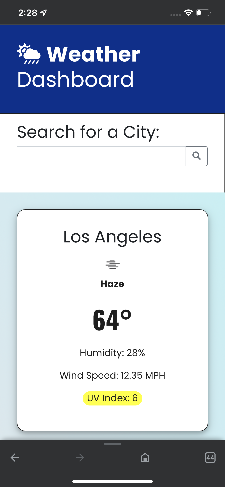

# Server-Side-APIs-Weather-Dashboard 
# Weather Dashboard
A weather dashboard that provides current and future weather forecasts. Utilizes OpenWeather API to retrieve weather data for cities and incorporates localStorage to store data.
# build with
HTML
CSS
JavaScript
jQuery
OpenWeather API
# Deployment
https://rober2092.github.io/Server-Side-APIs-Weather-Dashboard/
# mobile screenshoot
